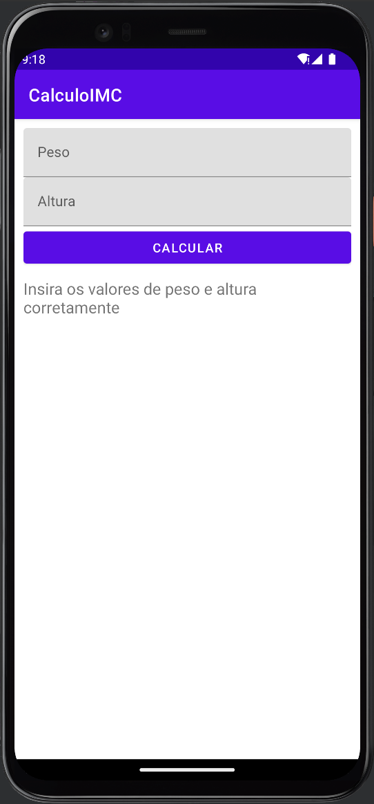
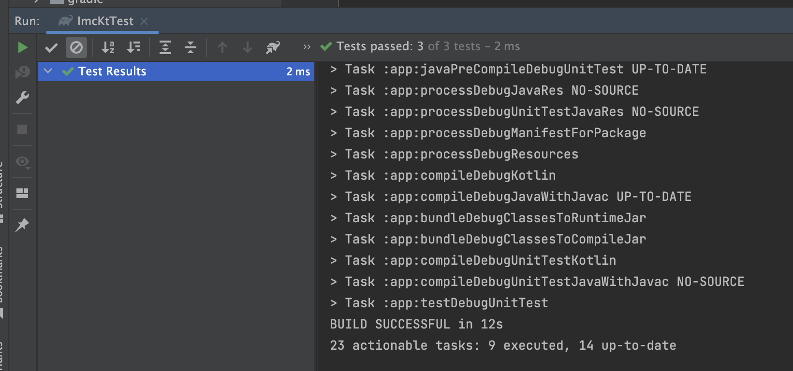

# Calculadora de IMC c/ Testes
versionCode: "1" 
versionName: "1.0.1"

# Introdução
Este aplicativo foi desenvolvido para fins academicos na aula de Desenvolvimento Android com Kotlin  

Este aplicativo tem como objetivo calcular o IMC (Índice de Massa Corporal). Você deverá preencher seu altura e seu peso, pressionar o botão de "calcular" e logo abaixo teremos o resultado final.

# Testes

O objetivo deste projeto é realizamos os testes, neste caso temos apenas uma classe principal que contém a regra de negócio do Aplicativo.
Neste caso estamos testando 3 tipos de potênciais situações:
1. Quando o usuário preenche corretamente os valores e o resultado volta positivo;
2. Quando o usuário preenche apenas a altura e deixa o valor do peso em branco, assim retornando a mensagem de erro;
3. Quando o oporto da cena 2. ocorre, ou seja, contendo o peso e faltando a altura.

